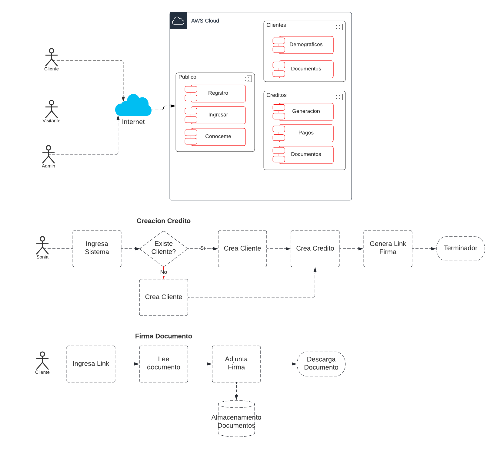
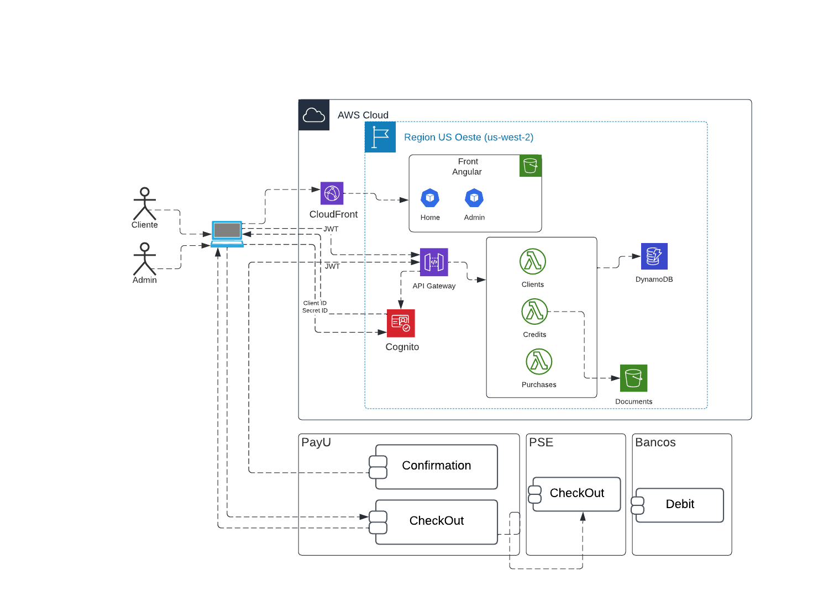

# Creditos
.....

| Servicio      | Descripción                                                                                                                                                                                               | 
|---------------|-----------------------------------------------------------------------------------------------------------------------------------------------------------------------------------------------------------| 
| FrontAngualar | Manejo de la presentacion de la pagina (home, client y photographer.)                                                                                                                                     |
| CloudFront    | Servidor del front.                                                                                                                                                                                       | 
| ApiGateway    | Habilita todos los servicios back, tambien valida el token JWT.                                                                                                                                           |
| Cognito       | Este servicio habilita el control de usuarios de la plataforma                                                                                                                                            |
| addGroup      | Esta lambda se encarga de incluir al grupo clientes a los usuarios nuevos.                                                                                                                                |
| Photos        | En este bucket de S3 se almacenan todos las fotografias de los eventos.                                                                                                                                   |
| addTags       | Esta lambda se activa una vez llega una foto al bucket y por medio del servicio Rekognition de aws identifica que hay en la imagen y el texto que tiene, dejando todo el analisis en los tags de la foto. |
| events       | Esta lambda se encarga de todo el modelo de datos event. |